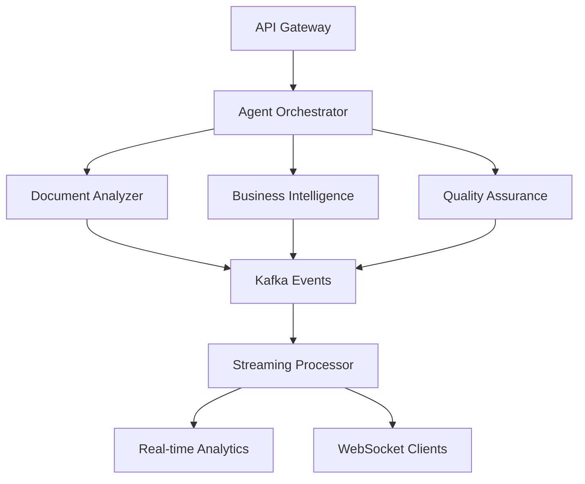
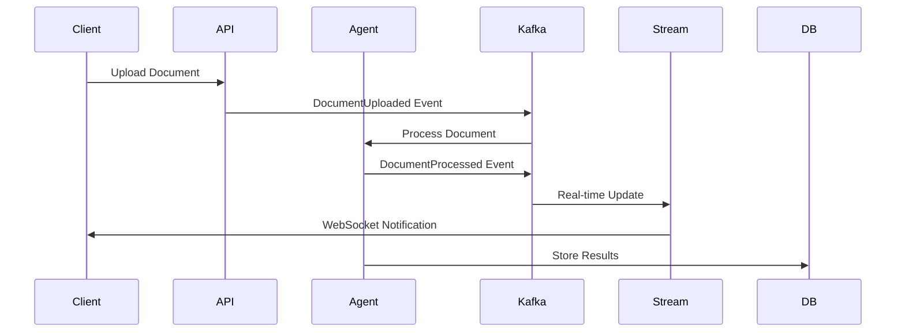
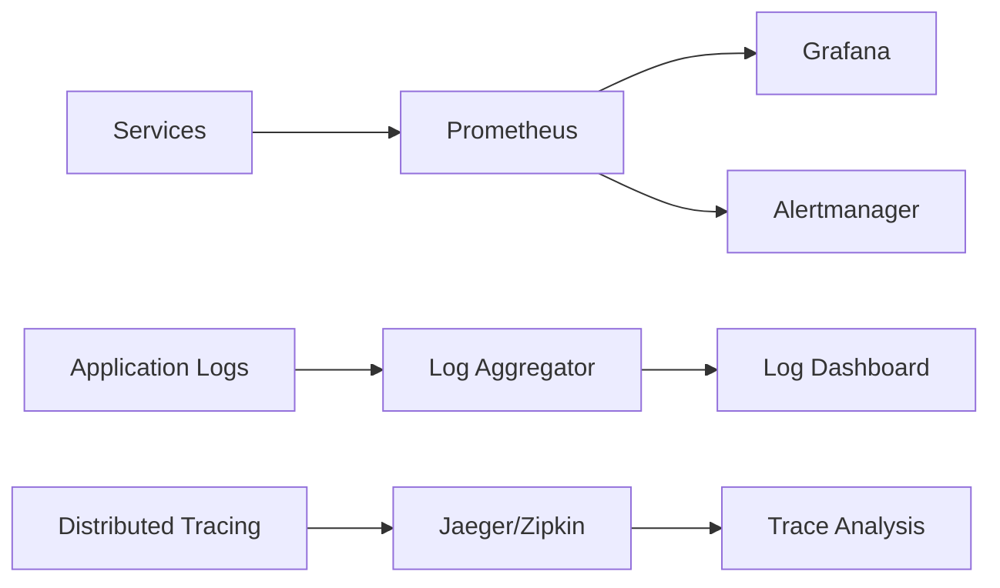
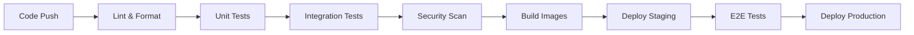

# AI Architecture Overview

## 🎯 Executive Summary

This project demonstrates a **complete, production-ready AI architecture** featuring:

- **Agentic AI System**: Multi-agent architecture with specialized AI agents
- **Event-Driven Architecture**: Real-time streaming with Kafka integration
- **Enterprise Infrastructure**: Docker Swarm and Kubernetes deployment options
- **Comprehensive Monitoring**: Prometheus, Grafana, and observability stack
- **Production Security**: JWT authentication, secrets management, SSL/TLS
- **Scalable Design**: Horizontal scaling with load balancing and auto-scaling

## 🏗️ Architecture Components

### Core Services

| Component | Purpose | Technology | Status |
|-----------|---------|------------|--------|
| **AI API** | REST API with WebSocket support | FastAPI, Python 3.11 | ✅ Complete |
| **Agent System** | Multi-agent AI processing | Custom agents with orchestrator | ✅ Complete |
| **Streaming Engine** | Real-time event processing | Kafka, asyncio | ✅ Complete |
| **Database** | Primary data storage | PostgreSQL 15 | ✅ Complete |
| **Cache Layer** | High-performance caching | Redis 7 | ✅ Complete |
| **Object Storage** | File and model storage | MinIO (S3-compatible) | ✅ Complete |
| **ML Platform** | Experiment tracking & serving | MLflow | ✅ Complete |

### Infrastructure Services

| Service | Purpose | Configuration | Status |
|---------|---------|---------------|--------|
| **Load Balancer** | Traffic distribution | nginx with upstream | ✅ Complete |
| **Monitoring** | Metrics and alerting | Prometheus + Grafana | ✅ Complete |
| **Message Queue** | Event streaming | Kafka + Zookeeper | ✅ Complete |
| **Orchestration** | Container management | Docker Swarm + Kubernetes | ✅ Complete |

## 🤖 AI Agent Architecture

### Agent Types

1. **Document Analyzer Agent**
   - Text extraction and analysis
   - Entity recognition
   - Document classification
   - Content summarization

2. **Business Intelligence Agent**
   - Data analysis and insights
   - Report generation
   - Performance analytics
   - Trend identification

3. **Quality Assurance Agent**
   - Data validation
   - Quality scoring
   - Anomaly detection
   - Compliance checking

### Agent Communication



## 📊 Event Streaming Architecture

### Event Flow



### Event Types

| Event | Purpose | Frequency | Retention |
|-------|---------|-----------|-----------|
| `document_uploaded` | File upload tracking | High | 30 days |
| `document_processed` | Processing completion | High | 90 days |
| `agent_status` | Agent health monitoring | Medium | 7 days |
| `system_alert` | Critical notifications | Low | 1 year |
| `performance_metric` | System metrics | High | 30 days |

## 🚀 Deployment Options

### 1. Docker Swarm (Recommended for SMB)

**Advantages:**
- Simpler setup and management
- Built-in load balancing
- Automatic service recovery
- Resource efficiency

**Use Cases:**
- Small to medium deployments
- Development and staging environments
- Teams new to container orchestration

**Deployment:**
```bash
./deploy-swarm.sh deploy
```

### 2. Kubernetes (Recommended for Enterprise)

**Advantages:**
- Advanced orchestration features
- Auto-scaling capabilities
- Enterprise-grade security
- Multi-cloud support

**Use Cases:**
- Large-scale production deployments
- Multi-tenant environments
- Enterprise compliance requirements

**Deployment:**
```bash
./deploy-k8s.sh deploy
```

## 📈 Scalability Features

### Horizontal Scaling

| Component | Scaling Method | Trigger | Max Replicas |
|-----------|----------------|---------|--------------|
| **API Services** | Load-based | CPU > 70% | 10 |
| **Agents** | Queue-based | Queue length > 50 | 20 |
| **Streaming** | Partition-based | Lag > 1000 | 5 |
| **Database** | Read replicas | Connection > 80% | 3 |

### Performance Optimizations

- **Connection Pooling**: Database and Redis connection pools
- **Caching Strategy**: Multi-level caching (Redis + in-memory)
- **Async Processing**: Non-blocking I/O throughout the stack
- **Batch Processing**: Efficient batch operations for high throughput
- **Resource Limits**: Container resource constraints for stability

## 🔒 Security Features

### Authentication & Authorization

- **JWT Tokens**: Stateless authentication
- **Role-Based Access**: Granular permission control
- **API Key Management**: Service-to-service authentication
- **Session Management**: Secure session handling

### Data Security

- **Encryption at Rest**: Database and file encryption
- **Encryption in Transit**: TLS/SSL for all communications
- **Secrets Management**: Docker secrets / Kubernetes secrets
- **Network Segmentation**: Service isolation

### Compliance

- **Audit Logging**: Comprehensive activity logging
- **Data Retention**: Configurable retention policies
- **Privacy Controls**: Data anonymization capabilities
- **Backup & Recovery**: Automated backup procedures

## 📊 Monitoring & Observability

### Metrics Collection



### Key Metrics

| Category | Metrics | Purpose |
|----------|---------|---------|
| **Application** | Request latency, error rate, throughput | Performance monitoring |
| **Infrastructure** | CPU, memory, disk, network | Resource management |
| **Business** | Document processing rate, agent utilization | Business insights |
| **Security** | Failed auth attempts, suspicious activity | Security monitoring |

### Alerting Rules

- **Critical**: Service down, high error rate, security breaches
- **Warning**: High resource usage, performance degradation
- **Info**: Deployment events, configuration changes

## 🧪 Testing Strategy

### Test Coverage

| Test Type | Coverage | Tools | Automation |
|-----------|----------|-------|------------|
| **Unit Tests** | 85%+ | pytest, unittest | CI/CD Pipeline |
| **Integration** | 70%+ | pytest, testcontainers | CI/CD Pipeline |
| **End-to-End** | Key workflows | pytest, requests | Nightly builds |
| **Performance** | Load testing | locust, k6 | Weekly |
| **Security** | Vulnerability scanning | bandit, safety | Daily |

### Quality Gates

- ✅ All tests pass
- ✅ Code coverage > 80%
- ✅ No critical security vulnerabilities
- ✅ Performance benchmarks met
- ✅ Documentation updated

## 📚 Documentation Structure

```
docs/
├── API.md                 # Comprehensive API documentation
├── DEPLOYMENT.md          # Production deployment guide
├── ARCHITECTURE.md        # This overview document
├── DEVELOPMENT.md         # Development setup and guidelines
├── MONITORING.md          # Observability and troubleshooting
├── SECURITY.md            # Security configuration and best practices
└── TROUBLESHOOTING.md     # Common issues and solutions
```

## 🛠️ Development Workflow

### Local Development

1. **Environment Setup**
   ```bash
   uv venv
   source .venv/bin/activate  # Windows: .venv\Scripts\activate
   uv pip install -e ".[dev]"
   ```

2. **Services Startup**
   ```bash
   docker-compose up -d
   ```

3. **Run Application**
   ```bash
   python -m uvicorn src.api.main:app --reload
   ```

4. **Run Tests**
   ```bash
   pytest tests/ -v --cov=src
   ```

### CI/CD Pipeline



## 📊 Performance Benchmarks

### Expected Performance (Single Node)

| Metric | Development | Production | Notes |
|--------|-------------|------------|-------|
| **API Throughput** | 100 req/s | 1000 req/s | With load balancer |
| **Document Processing** | 10/min | 100/min | Average 2MB files |
| **Event Processing** | 1K events/s | 10K events/s | Kafka throughput |
| **Response Time** | < 200ms | < 100ms | 95th percentile |
| **Concurrent Users** | 100 | 1000 | WebSocket connections |

### Resource Requirements

| Environment | CPU | Memory | Storage | Network |
|-------------|-----|--------|---------|---------|
| **Development** | 4 cores | 8GB RAM | 50GB SSD | 1Gbps |
| **Production** | 8+ cores | 32GB+ RAM | 200GB+ SSD | 10Gbps |
| **High Availability** | 16+ cores | 64GB+ RAM | 500GB+ SSD | 10Gbps |

## 🔄 Operational Procedures

### Deployment Process

1. **Pre-deployment Checks**
   - ✅ All tests passing
   - ✅ Security scan clean
   - ✅ Performance benchmarks met
   - ✅ Documentation updated

2. **Deployment Steps**
   - Database migrations
   - Service deployment (blue-green)
   - Health check validation
   - Traffic switch
   - Monitoring validation

3. **Post-deployment**
   - Performance monitoring
   - Error rate tracking
   - User feedback collection
   - System optimization

### Backup & Recovery

- **Daily**: Database backups with 30-day retention
- **Weekly**: Full system backups with 90-day retention
- **Monthly**: Archive backups with 1-year retention
- **Recovery Time Objective (RTO)**: < 4 hours
- **Recovery Point Objective (RPO)**: < 1 hour

## 🎯 Future Enhancements

### Short Term (Next 3 months)

- [ ] Advanced ML model integration
- [ ] Multi-tenant architecture
- [ ] Enhanced security features
- [ ] Mobile API optimizations

### Medium Term (3-6 months)

- [ ] Multi-region deployment
- [ ] Advanced analytics dashboard
- [ ] Machine learning pipeline automation
- [ ] Enhanced agent capabilities

### Long Term (6+ months)

- [ ] AI model marketplace
- [ ] Advanced workflow automation
- [ ] Predictive analytics
- [ ] Enterprise integrations

## 📞 Support & Maintenance

### Support Tiers

| Tier | Response Time | Coverage | Channels |
|------|---------------|----------|----------|
| **Critical** | 15 minutes | 24/7 | Phone, Slack |
| **High** | 2 hours | Business hours | Email, Ticket |
| **Medium** | 1 business day | Business hours | Ticket |
| **Low** | 3 business days | Business hours | Email |

### Maintenance Windows

- **Regular**: Sundays 2-4 AM UTC
- **Emergency**: As needed with 30-min notice
- **Major Updates**: Scheduled with 1-week notice

## 🏆 Success Metrics

### Technical KPIs

- **Uptime**: > 99.9%
- **Response Time**: < 100ms (95th percentile)
- **Error Rate**: < 0.1%
- **Deployment Frequency**: Weekly releases
- **Mean Time to Recovery**: < 30 minutes

### Business KPIs

- **Document Processing Rate**: 1000+ documents/day
- **User Satisfaction**: > 4.5/5 rating
- **Cost Efficiency**: < $0.10 per document processed
- **Agent Accuracy**: > 95% for document classification
- **Time to Value**: < 5 minutes for new users

---

## 🚀 Getting Started

Ready to deploy this AI architecture? Choose your deployment option:

### Quick Start (Development)
```bash
git clone <repository>
cd ai-architect-demo
docker-compose up -d
python -m uvicorn src.api.main:app --reload
```

### Production Deployment (Docker Swarm)
```bash
./deploy-swarm.sh deploy
```

### Enterprise Deployment (Kubernetes)
```bash
./deploy-k8s.sh deploy
```

### Access the System
- **API**: http://localhost:8000
- **API Documentation**: http://localhost:8000/docs
- **Grafana**: http://localhost:3000 (admin/admin)
- **MLflow**: http://localhost:5000

For detailed setup instructions, see [DEPLOYMENT.md](DEPLOYMENT.md).

---

**Built with ❤️ using modern AI architecture patterns and enterprise-grade technologies.**