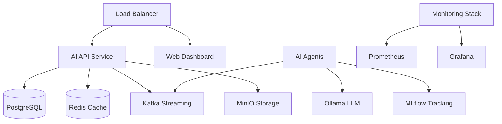

# Deployment Guide

This directory contains comprehensive deployment documentation for the AI Architecture Demo platform.

## Deployment Options

| Environment | Documentation | Complexity | Recommended For |
|------------|---------------|------------|-----------------|
| [Local Development](local-development.md) | Docker Compose | Low | Development & Testing |
| [Docker Swarm](docker-swarm.md) | Production Swarm | Medium | SMB Production |
| [Kubernetes](kubernetes.md) | K8s Manifests | High | Enterprise Production |
| [Cloud Deployment](cloud-deployment.md) | AWS/Azure/GCP | High | Managed Cloud |

## Quick Start

### Development Environment
```bash
git clone <repository>
cd ai-architect-demo
docker-compose up -d
```

### Production Deployment
```bash
# Docker Swarm
./deploy-swarm.sh deploy

# Kubernetes
./deploy-k8s.sh deploy
```

## Documentation Index

### Setup Guides
- [Prerequisites](prerequisites.md) - System requirements and dependencies
- [Installation](installation.md) - Step-by-step installation guide
- [Configuration](configuration.md) - Environment and security configuration

### Deployment Methods
- [Local Development](local-development.md) - Docker Compose for development
- [Docker Swarm](docker-swarm.md) - Production deployment with Docker Swarm
- [Kubernetes](kubernetes.md) - Enterprise Kubernetes deployment
- [Cloud Deployment](cloud-deployment.md) - AWS, Azure, GCP deployment guides

### Operations
- [Monitoring](monitoring.md) - Metrics, logging, and alerting setup
- [Backup & Recovery](backup-recovery.md) - Data protection strategies
- [Scaling](scaling.md) - Horizontal and vertical scaling guides
- [Security](security.md) - Security hardening and best practices
- [Troubleshooting](troubleshooting.md) - Common issues and solutions

### Advanced Topics
- [High Availability](high-availability.md) - Multi-node, fault-tolerant setup
- [Performance Tuning](performance-tuning.md) - Optimization strategies
- [Custom Integrations](integrations.md) - Third-party system integration
- [Migration Guide](migration.md) - Version upgrade procedures

## System Requirements

### Minimum Requirements (Development)
- **CPU**: 4 cores
- **Memory**: 8GB RAM
- **Storage**: 50GB SSD
- **Network**: 1Gbps

### Recommended (Production)
- **CPU**: 8+ cores
- **Memory**: 32GB+ RAM  
- **Storage**: 200GB+ SSD
- **Network**: 10Gbps

### High Availability (Enterprise)
- **CPU**: 16+ cores per node
- **Memory**: 64GB+ RAM per node
- **Storage**: 500GB+ SSD per node
- **Network**: 10Gbps with redundancy

## Service Architecture



## Deployment Checklist

### Pre-Deployment
- [ ] System requirements verified
- [ ] Dependencies installed
- [ ] Environment variables configured
- [ ] SSL certificates prepared (production)
- [ ] Backup strategy planned

### Deployment
- [ ] Infrastructure services started
- [ ] Application services deployed
- [ ] Health checks passing
- [ ] Monitoring configured
- [ ] Load testing completed

### Post-Deployment
- [ ] Performance monitoring enabled
- [ ] Alerting rules configured
- [ ] Backup procedures tested
- [ ] Documentation updated
- [ ] Team training completed

## Support & Maintenance

### Maintenance Windows
- **Development**: No scheduled maintenance
- **Staging**: Sundays 2-4 AM UTC
- **Production**: Planned maintenance with 1-week notice

### Support Channels
- **Critical Issues**: Phone/Slack (24/7)
- **General Support**: GitHub Issues
- **Documentation**: This directory