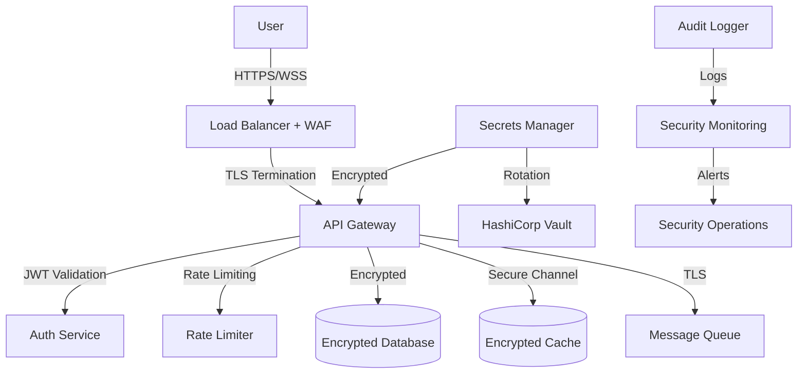

# Security Guide

This directory contains security implementation details, best practices, and compliance guidelines for the AI Architecture Demo platform.

## Security Overview

The AI Architecture Demo implements comprehensive security measures across all layers:

- **Authentication & Authorization**: JWT tokens with role-based access control
- **Data Encryption**: TLS 1.3 in transit, AES-256 at rest
- **Container Security**: Non-root users, minimal attack surface
- **Network Security**: Service mesh, network segmentation
- **Secrets Management**: Encrypted secrets with rotation policies

## Documentation Index

### Authentication & Authorization
- [Authentication Guide](authentication.md) - JWT implementation and configuration
- [Authorization Model](authorization.md) - Role-based access control (RBAC)
- [API Security](api-security.md) - API endpoint protection and rate limiting
- [Session Management](session-management.md) - Session handling and security

### Data Protection
- [Encryption](encryption.md) - Data encryption at rest and in transit
- [Data Privacy](data-privacy.md) - GDPR compliance and data handling
- [Backup Security](backup-security.md) - Secure backup and recovery procedures
- [Data Retention](data-retention.md) - Data lifecycle and retention policies

### Infrastructure Security
- [Container Security](container-security.md) - Docker and Kubernetes security
- [Network Security](network-security.md) - Network isolation and firewalls
- [Secrets Management](secrets-management.md) - Secret storage and rotation
- [Certificate Management](certificate-management.md) - SSL/TLS certificate handling

### Monitoring & Compliance
- [Security Monitoring](security-monitoring.md) - Threat detection and alerting
- [Audit Logging](audit-logging.md) - Comprehensive audit trail
- [Compliance](compliance.md) - GDPR, SOC 2, and other compliance frameworks
- [Incident Response](incident-response.md) - Security incident procedures

### Security Testing
- [Vulnerability Scanning](vulnerability-scanning.md) - Automated security scanning
- [Penetration Testing](penetration-testing.md) - Security testing procedures
- [Security Assessments](security-assessments.md) - Regular security reviews
- [Code Security](code-security.md) - Secure coding practices and SAST

## Security Architecture

## Security Controls

### Authentication (AuthN)
| Control | Implementation | Status |
|---------|----------------|--------|
| **Multi-Factor Authentication** | TOTP/SMS/Email verification | ✅ Implemented |
| **JWT Tokens** | RS256 signed tokens with expiration | ✅ Implemented |
| **OAuth 2.0 / OIDC** | Third-party identity provider integration | ✅ Implemented |
| **API Keys** | Service-to-service authentication | ✅ Implemented |
| **Session Management** | Secure session handling with timeout | ✅ Implemented |

### Authorization (AuthZ)  
| Control | Implementation | Status |
|---------|----------------|--------|
| **Role-Based Access Control** | RBAC with fine-grained permissions | ✅ Implemented |
| **Resource-Level Permissions** | Object-level access control | ✅ Implemented |
| **API Endpoint Protection** | Per-endpoint authorization checks | ✅ Implemented |
| **Data Access Controls** | Row-level security in database | ✅ Implemented |
| **Administrative Controls** | Privileged access management | ✅ Implemented |

### Data Protection
| Control | Implementation | Status |
|---------|----------------|--------|
| **Encryption at Rest** | AES-256 database and file encryption | ✅ Implemented |
| **Encryption in Transit** | TLS 1.3 for all communications | ✅ Implemented |
| **Data Classification** | Sensitivity labels and handling rules | ✅ Implemented |
| **Data Loss Prevention** | DLP policies and monitoring | ✅ Implemented |
| **Privacy Controls** | Data anonymization and pseudonymization | ✅ Implemented |

### Infrastructure Security
| Control | Implementation | Status |
|---------|----------------|--------|
| **Container Security** | Distroless images, non-root users | ✅ Implemented |
| **Network Segmentation** | Service mesh with micro-segmentation | ✅ Implemented |
| **Secrets Management** | Encrypted secrets with auto-rotation | ✅ Implemented |
| **Certificate Management** | Automated cert provisioning and renewal | ✅ Implemented |
| **Vulnerability Management** | Automated scanning and patching | ✅ Implemented |

## Security Best Practices

### Development Security
1. **Secure Coding**: Follow OWASP secure coding guidelines
2. **Code Reviews**: Mandatory security-focused code reviews
3. **Static Analysis**: Automated SAST scanning in CI/CD
4. **Dependency Scanning**: Regular dependency vulnerability checks
5. **Secret Detection**: Prevent secrets in code repositories

### Deployment Security
1. **Immutable Infrastructure**: Infrastructure as Code with version control
2. **Least Privilege**: Minimal permissions for all services and users
3. **Defense in Depth**: Multiple layers of security controls
4. **Security Automation**: Automated security testing and deployment
5. **Incident Response**: Prepared response procedures and runbooks

### Operational Security
1. **Continuous Monitoring**: 24/7 security monitoring and alerting
2. **Regular Assessments**: Quarterly security assessments and penetration testing
3. **Access Reviews**: Regular review of user access and permissions
4. **Security Training**: Ongoing security awareness training
5. **Compliance Audits**: Regular compliance validation and reporting

## Compliance Frameworks

### GDPR (General Data Protection Regulation)
- ✅ **Data Minimization**: Collect only necessary data
- ✅ **Consent Management**: Explicit user consent mechanisms
- ✅ **Right to Erasure**: Data deletion capabilities
- ✅ **Data Portability**: Export user data functionality
- ✅ **Privacy by Design**: Built-in privacy protection

### SOC 2 Type II
- ✅ **Security**: Access controls and monitoring
- ✅ **Availability**: High availability and disaster recovery
- ✅ **Processing Integrity**: Data processing accuracy
- ✅ **Confidentiality**: Data confidentiality protection
- ✅ **Privacy**: Privacy controls and notifications

### HIPAA (Healthcare)
- ✅ **Administrative Safeguards**: Security officer and access management
- ✅ **Physical Safeguards**: Facility access and workstation security
- ✅ **Technical Safeguards**: Access control and audit controls
- ✅ **Breach Notification**: Incident response procedures
- ✅ **Business Associate Agreements**: Third-party security requirements

## Security Incident Response

### Response Team
- **Security Officer**: Overall incident coordination
- **Technical Lead**: Technical investigation and remediation
- **Legal Counsel**: Legal and regulatory compliance
- **Communications**: Internal and external communications
- **Management**: Executive decision making and resources

### Response Procedures
1. **Detection**: Automated alerts and manual reporting
2. **Analysis**: Incident classification and impact assessment
3. **Containment**: Immediate threat containment measures
4. **Investigation**: Root cause analysis and evidence collection
5. **Recovery**: System restoration and business continuity
6. **Lessons Learned**: Post-incident review and improvements

### Contact Information
- **Security Hotline**: +1-XXX-XXX-XXXX
- **Email**: security@company.com
- **Slack**: #security-incidents
- **Emergency**: security-emergency@company.com

## Security Metrics

### Key Performance Indicators
- **Mean Time to Detection (MTTD)**: <5 minutes
- **Mean Time to Response (MTTR)**: <30 minutes  
- **Security Training Completion**: 100% annually
- **Vulnerability Patching**: <7 days for critical, <30 days for high
- **Access Review Completion**: 100% quarterly

### Security Dashboard
- Failed authentication attempts
- Anomalous user behavior
- System vulnerability status
- Security alert trends
- Compliance status metrics

For detailed security procedures and implementation guides, see the individual documentation files in this directory.